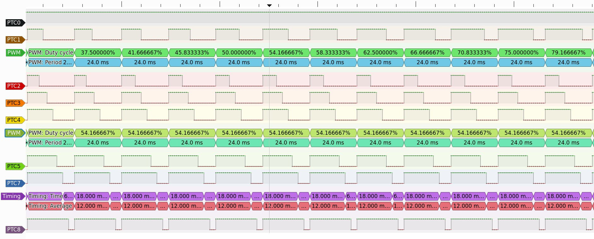

# apps-pwm-simulator

Place your code to the `main.cpp` and run with: 
```sh
$ make && ./main
 PTC0           PTC1           PTC2          PTC3           PTC4           PTC5           PTC7           PTC8
 t_on/T         t_on/T         t_on/T        t_on/T         t_on/T         t_on/T         t_on/T         t_on/T
 0/ 1 (  0%)    5/24 ( 20%)    0/ 1 (  0%)   10/24 ( 41%)   13/24 ( 54%)   15/24 ( 62%)   18/24 ( 75%)   21/24 ( 87%)   
 0/ 1 (  0%)    5/24 ( 20%)    0/ 1 (  0%)   10/24 ( 41%)   13/24 ( 54%)   15/24 ( 62%)   18/24 ( 75%)   21/24 ( 87%)   
 0/ 1 (  0%)    5/24 ( 20%)    0/ 1 (  0%)   10/24 ( 41%)   13/24 ( 54%)   15/24 ( 62%)   18/24 ( 75%)   21/24 ( 87%)   
 0/ 1 (  0%)    5/24 ( 20%)    0/ 1 (  0%)   10/24 ( 41%)   13/24 ( 54%)   15/24 ( 62%)   18/24 ( 75%)   21/24 ( 87%)   
 0/ 1 (  0%)    5/24 ( 20%)    0/ 1 (  0%)   10/24 ( 41%)   13/24 ( 54%)   15/24 ( 62%)   18/24 ( 75%)   21/24 ( 87%)   
 0/ 1 (  0%)    5/24 ( 20%)    0/ 1 (  0%)   10/24 ( 41%)   13/24 ( 54%)   15/24 ( 62%)   18/24 ( 75%)   21/24 ( 87%)   
 0/ 1 (  0%)    5/24 ( 20%)    0/ 1 (  0%)   10/24 ( 41%)   13/24 ( 54%)   15/24 ( 62%)   18/24 ( 75%)   21/24 ( 87%)   
 ...
```

```
<-- t_on -> 
__________          __________
|         |         |         |         | ....
|         |         |         |         | ....
|         |_________|         |_________| ....
0         t0        T        t0        2T ....
<-------- T -------->


```

Pins logic levels are sampled in each millisecond and stored to the `record.csv` file.
Record can be opened in [PulseView](https://sigrok.org/wiki/Downloads) with:
```sh
$ pulseview ./record.csv -I csv:samplerate=1000
```


